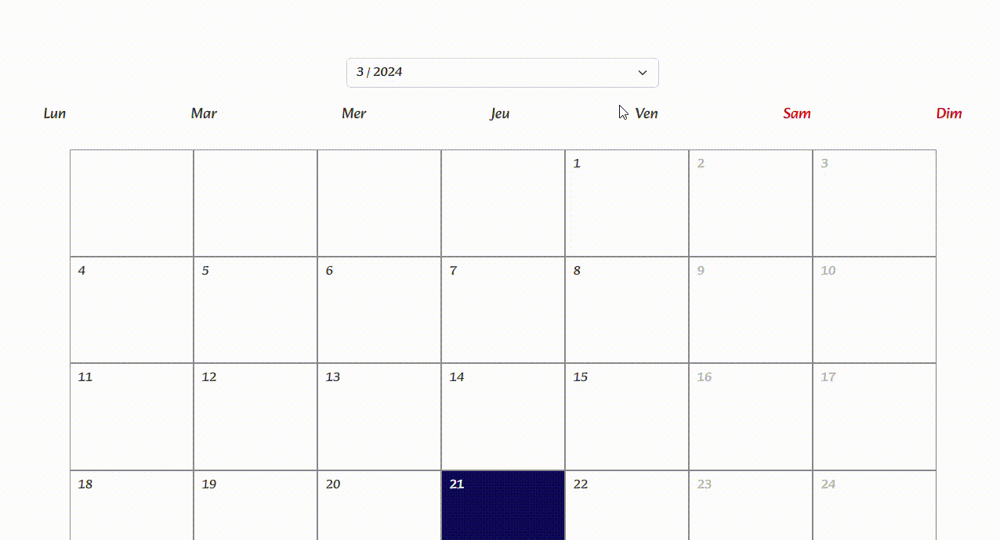
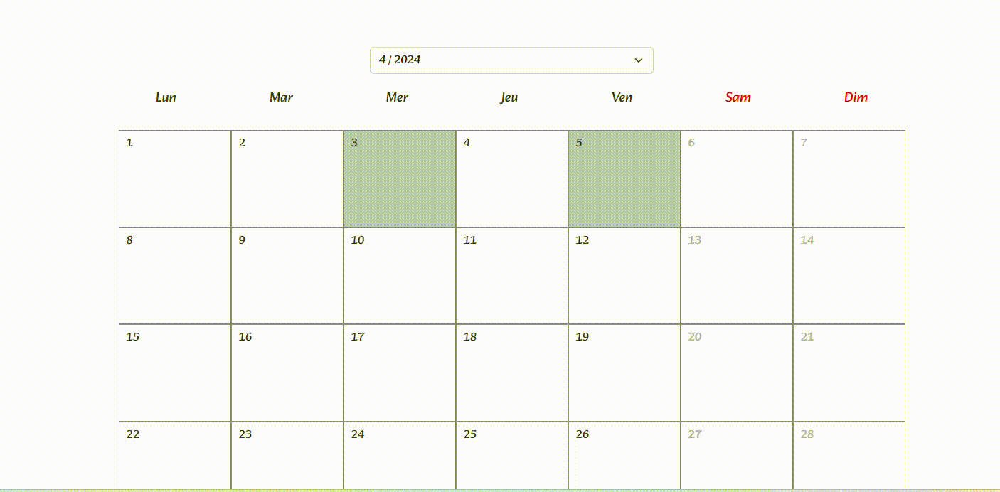

# Salaisons de la Brèche
## 소개
>Salaisons de la Brèche라는 회사는 돼지고기를 가공해 만든 식품인 Saucisson( 쏘시쏭 )을 제조하는 회사입니다.  
>회사가 추구하는 웹사이트의 목적은 고품질 재료와 전통적인 방법을 사용한 제품생산이라는 사실을 강조하는 것입니다.  
>또한 제품 관련 문의를 많이 받기 때문에 프론트엔드에서 회사 연락처와 문의하기 페이지를 웹사이트에 잘 나타나도록 했습니다.
>특히 주 고객들의 연령층이 50 ~ 80 정도의 연세가 있으신 분들이기 때문에 제품소개 페이지로 잘 도달할 수 있도록 페이지 클릭 강조 효과를 추가했습니다.
>
>백엔드 서버에서는 문의하기, login, 달력으로 주문 관리 ,첨부파일 다운로드와 전송, 
>주문 정보 보내기 등의 기능들을 구현했습니다.  
>모든 기능이 잘 동작하지만 지금 서비스되는 기능은 문의하기 기능 하나입니다.

<br />

## 사용 기술
#### 프론트엔드
- React
- Bootstrap
- Gsap
- Axios

<br />

#### 백엔드
- Python:3.11
- Django:4.2
- python-dotenv:1.0.0

<br />

## 프로젝트 구조
<details>
<summary><b>프론트엔드 프로젝트 구조</b></summary>

```commandline
- src
  - components
  - contexts
  - hooks
  - providers
  - styles
    .
    .
    .
```
모든 컴포넌트들은 components 폴더 안에 넣었고 contexts 폴더 안에는 AppStateContext.jsx 라는 jsx 파일을 만들어  
```javascript
import React from "react";

const AppStateContext = React.createContext();

export default AppStateContext;
```
리엑트 Context를 생성했습니다.

그리고 providers 폴더 안에 함수와 state들을 hook으로 전달하기 위한 AppStateProvider.jsx 파일을 만들었고 hook들은 hooks 폴더 안에 정리했습니다.

css 파일들은 styles 폴더 안에 넣었습니다.
</details>
<br />
<details>
<summary><b>백엔드 프로젝트 구조</b></summary>

```commandline
- salaisons-de-la-breche(프로젝트 파일)
    - api
    - users
    - client
        - index.html
        - static
    - media
        - upload
        - Bon_de_commande_CSE_-_SALAISONS_DE_LA_BRECHE.pdf
        - MODELE_Tableau_CSE_2022.xlsx
    - mysite
        - settings.py
        - urls.py
```
api와 users 두 개의 앱을 생성해 로그인, 주문 관련 기능들은 api앱 안에 작성했고  
사용자 관련한 기능들은 users 앱 안에서 코드를 작성했습니다.

client 폴더는 일반적인 Django 의 Templates 폴더를 대체하는 폴더입니다.

media 폴더는 고객들이 주문하기 위해 필요한 주문 양식서들이 있고  
고객들이 주문서를 제출할 때 주문서들이 upload 폴더 안으로 갈 수 있도록 api앱 models.py에서 설정했습니다.
```python
class Order(models.Model):
    ...
    order_file = models.FileField(upload_to='upload/', null=True,)
    ...
```
<br />

settings.py에는 스태틱 파일과 미디어 파일에 대해 설정했고   
Django의 EmailMessage를 사용하기 위해 gmail에 맞는 필요 코드를 작성했습니다.
```python
STATIC_ROOT ='/home/salaisonsdel/public_html/static'
STATIC_URL = '/static/'
STATICFILES_DIRS = [
  os.path.join(BASE_DIR, 'client/static')
]

...

MEDIA_ROOT = os.path.join(BASE_DIR, 'media')
MEDIA_URL = 'media/'

...

EMAIL_BACKEND = 'django.core.mail.backends.smtp.EmailBackend'
EMAIL_HOST = "smtp.gmail.com"
EMAIL_PORT = 587
EMAIL_HOST_USER = 'contact@salaisonsdelabreche.com'
EMAIL_HOST_PASSWORD = os.getenv("APP_PASSWORD")
EMAIL_USE_TLS = True
DEFAULT_FROM_EMAIL = EMAIL_HOST_USER
```
</details>

<br />

## 핵심 기능
>- 이 프로젝트에 있는 모든 기능을 보여드리는 것이 아닌
>웹사이트에서 중요한 몇 가지 기능을 밑에 서술했습니다.

>- 지금 서비스되는 기능은 문의하기 기능 하나입니다.  
>다른 구현한 기능들은 잘 동작하지만, 아직 서비스 상태 전입니다.

<details>
<summary><b>문의하기</b></summary>

고객들이 웹사이트를 통해 문의하고 메일이 잘 전송되었는지 자동으로 확인받는 컨텍트 기능을 구현하기 위해서 users 앱에 있는 models.py에 Contact 모델을 작성했습니다.
```python
class Contact(models.Model):
    nom = models.CharField(max_length=30)
    prenom = models.CharField(max_length=30)
    number = models.CharField(max_length=30)
    email = models.EmailField(max_length=100)
    create_dt = models.DateTimeField(blank=True)
    sujet = models.CharField(max_length=250, null=True, blank=True)
    question = models.TextField()

    def __str__(self):
        return self.nom

# nom, prenom 은 성, 이름 그리고 sujet는 메일의 제목입니다.
```
고객이 작성한 내용을 담을 수 있는 ContactForm을 모델 Form을 이용해서 작성.
```python
class ContactForm(forms.ModelForm):
    class Meta:
        model = Contact
        fields = '__all__'
```
ContactView 작성.
```python
class ContactView(View):
    def post(self, request, *args, **kwargs):
        form = ContactForm(request.POST)
        if form.is_valid():
            form.instance.create_dt = datetime.datetime.now(pytz.timezone("Europe/Paris"))
            obj = form.save()
            post = obj_to_contact(obj)
            title = f"Contact via site internet {post['create_dt']}"
            title_client = "Confirmation d'envoi"
            content = (f"<p><strong>Nom : </strong>{post['nom']}</p>"
                       f"<p><strong>Prenom : </strong>{post['prenom']}</p>"
                       f"<p><strong>Numero de Téléphone : </strong>{post['number']}</p>"
                       f"<p><strong>Email : </strong>{post['email']}</p>"
                       f"<p><strong>Objet : </strong>{post['sujet']}</p>"
                       f"<br />"
                       f"<strong>La demande : </strong>"
                       f"<br />"
                       f"<p>{post['question']}</p>")
            content_client = (f"<p>Bonjour,</p>"
                              f"<p>Votre demande ci-dessous a bien été envoyée.</p>"
                              f"<br />"
                              f"<strong>{post['question']}</strong>"
                              f"<br />"
                              f"<br />"
                              f"<p>Elle sera traitée dans les meilleurs délais.</p>"
                              f"<p>Cordialement,</p>"
                              f"<P>SALAISONS DE LA BRÈCHE</P>")
            email = EmailMessage(subject=title, body=content, to=['contact@salaisonsdelabreche.com', 'salaisons.de.la.breche@orange.fr'])
            email2 = EmailMessage(subject=title_client, body=content_client, to=[post['email']])
            email.content_subtype="html"
            email2.content_subtype= "html"
            email.send()
            email2.send()
            return JsonResponse(data=post, safe=True, status=200)
        else:
            return JsonResponse(data=form.errors, safe=True, status=400)
```
ContactView에서 메일 생성시간을 제목 옆에 나타냄으로써 회사 이메일 보관함에 메일이 겹쳐서 보이지 않도록 처리했습니다.  
고객이 회사로 보내는 문의 메일은 email, 자동으로 회사에서 고객한테 보내는 답장 메일은 email2로 담아서 send 메소드로 기능을 구현했습니다.

<br />

데이터들을 프론트엔드 서버에 전달하기 위해 딕셔너리 객체로 변환해 줄 obj_to_contact 함수를 만들어 사용했습니다.
```python
def obj_to_contact(obj):
    post = dict(vars(obj))
    if post['sujet'] is None:
        post['sujet'] = ""

    if obj.create_dt:
        post['create_dt'] = obj.create_dt.strftime('%d/%m/%Y %H:%M')
    else:
        post['create_dt'] = ''

    del post['_state']

    return post
```
프론트엔드(React)에서 기능을 실행시킬 수 있도록 코드를 작성했습니다.
```javascript
const [value, setValue] = useState("");
const [btnState, setBtnState] = useState(false);

const submit = useCallback(() => {
    setBtnState(true);
    const formdata = new FormData(document.getElementById("contact_form"));
    formdata.append("create_dt", "");
    axios
      .post("/user/contact/", formdata)
      .then((res) => {
        window.location.href = "/contact/envoyé";
      })
      .catch((err) => {
        console.log(err.response);
        alert(
          "La demande n’a pas pu être envoyée. \nMerci de renseigner correctement tous les champs obligatoires (*)."
        );
        setBtnState(false)
      });
  }, []);
```
전송 버튼을 누르면 submit 함수가 실행 되도록 하였습니다.  
전송이 성공적으로 실행되면 전송이 잘 되었다는 문구가 적힌 페이지로 이동이 되고 실패하면 alert 메시지를 띄웁니다.
```javascript
{btnState ? (
        <button style={{ padding: "5px 0" }} disabled>
          <Oval width={30} height={30} secondaryColor="black" />
        </button>
      ) : (
        <button onClick={submit}>Envoyer</button>
      )}
```
전송 버튼을 누르고 서버가 응답할 때까지 걸리는 시간 중에 버튼을 또 누르지 않도록 disabled 처리와 스피너가 보이도록 했습니다.
</details>

<br />

<details>
<summary><b>달력으로 주문 관리하기</b></summary>

웹사이트의 관리자 계정은 달력으로 주문을 쉽게 볼 수 있습니다.
```javascript
{user.email === "contact@salaisonsdelabreche.com" ? (
                  <>
                    <li
                      onClick={() => {
                        window.location.href = "/les-commandes/gestion";
                      }}
                    >
                      Gérer les dates
                    </li>
                  </>
                ) : (
                  <li
                    onClick={() => {
                      window.location.href = "/mes-commandes";
                    }}
                  >
                    Mes commandes
                  </li>
                )}
```
로그인한 이메일 주소가 contact@salaisonsdelabreche.com 이여야만 달력 관리 메뉴를 볼 수 있습니다.

<br />

달력을 위한 특별한 모듈을 사용하지 않고 직접 만들어 보았습니다.

먼저 오늘 날짜 객체와 요일을 정의했습니다.
```javascript
const today = {
    year: new Date().getFullYear(),
    month: new Date().getMonth() + 1,
    date: new Date().getDate(),
    day: new Date().getDay(),
  };
  const week = useMemo(
    () => ["Lun", "Mar", "Mer", "Jeu", "Ven", "Sam", "Dim"],
    []
  );
  const week2 = useMemo(
    () => ["Dim", "Lun", "Mar", "Mer", "Jeu", "Ven", "Sam"],
    []
  );
```
프랑스의 달력은 일요일이 아닌 월요일부터 시작이기 때문에 week 함수와 week2 함수를 정의했습니다.

년, 달, 일을 선택할 state를 만들었습니다.
```javascript
  const [monthSelect, setMonthSelect] = useState(today.month);
  const [yearSelect, setYearSelect] = useState(today.year);
  const [daySelect, setDaySelect] = useState(today.date);
```
마지막 날이 30일인지 31일인지 알려주는 date 객체를 정의했습니다.
```javascript
  const dateTotalCount = new Date(yearSelect, monthSelect, 0).getDate();
```

<br />

작년 이번 달부터 내년 이번 달까지 연도와 월을 선택할 수 있도록 보여주는 콜백함수를 정의했습니다.
```javascript
const YearMonthControl = useCallback(() => {
    let select = [];
    let startYear = today.year - 1;
    let endYear = today.year + 1;
    let startEndMonth = today.month;

    for (let i = 0; i < 25; i++) {
      select.push(
        <option
          key={i}
          value={new Date(
            startEndMonth + i > 13
              ? startEndMonth + i - 12 > 13
                ? endYear
                : startYear + 1
              : startYear,
            startEndMonth + i - 1 >= 13
              ? startEndMonth + i - 12 - 1 >= 13
                ? startEndMonth + i - 24 - 1
                : startEndMonth + i - 12 - 1
              : startEndMonth + i - 1,
            1
          ).toDateString()}
        >{`${
          startEndMonth + i >= 13
            ? startEndMonth + i - 12 >= 13
              ? startEndMonth + i - 24
              : startEndMonth + i - 12
            : startEndMonth + i
        } / ${
          startEndMonth + i >= 13
            ? startEndMonth + i - 12 >= 13
              ? endYear
              : startYear + 1
            : startYear
        }`}</option>
      );
    }
    return (
      <Form.Select
        defaultValue={new Date(yearSelect, monthSelect - 1, 1).toDateString()}
        onChange={yearMonthSelect}
      >
        {select}
      </Form.Select>
    );
  }, [today.year, today.month, yearMonthSelect, monthSelect, yearSelect]);
```


<br />
<br />

이제 요일을 보여줄 콜백함수를 정의했습니다.
```javascript
const ReturnWeek = useCallback(() => {
    let weekArr = [];
    week.forEach((w, i) => {
      weekArr.push(
        <div
          key={i + 1}
          className={w === "Sam" || w === "Dim" ? "weekday weekend" : "weekday"}
        >
          {w}
        </div>
      );
    });
    return weekArr;
  }, [week]);
```
그리고 달력을 그리는 콜백함수를 정의했습니다.
```javascript
const ReturnDays = useCallback(() => {
    let dayArr = [];

    for (const nowDay of week) {
      const day = new Date(yearSelect, monthSelect - 1, 1).getDay();

      if (week2[day] === nowDay) {
        for (let i = 0; i < dateTotalCount; i++) {
          dayArr.push(
            <div
              key={i + 1}
              className={
                new Date(yearSelect, monthSelect - 1, i + 1).getDay() === 0 ||
                new Date(yearSelect, monthSelect - 1, i + 1).getDay() === 6
                  ? "day weekend_day"
                  : new Date().toDateString() ===
                    new Date(yearSelect, monthSelect - 1, i + 1).toDateString()
                  ? "day selected_day"
                  : "day"
              }
              onClick={dayClick}
            >
              {i + 1}
            </div>
          );
        }
        return dayArr;
      } else {
        dayArr.push(<div key={nowDay} className="day day_vide"></div>);
      }
    }
  }, [dateTotalCount, monthSelect, yearSelect, week, week2]);
```

<br />

백엔드 서버에서 주문들이 달력에 보일 수 있도록 주문 리스트들을 가져옵니다.
```python
class ApiAdminListView( AdminOnlyMixin, BaseListView ):
    def get_queryset(self):
        if self.request.user.email == 'contact@salaisonsdelabreche.com':
            qs = Order.objects.all().order_by('-create_dt')
        else:
            qs = []
        return qs

    def render_to_response(self, context, **response_kwargs):
        qs = context['object_list']
        for obj in qs:
            if date.today() >= obj.date - timedelta(days=14) and not obj.pay:
                obj.paspaye = True
            elif date.today() >= obj.date - timedelta(days=14) and obj.pay:
                obj.validable = True
                if date.today() >= obj.date and obj.pay:
                    obj.done = True
            
        postList = [obj_to_order(obj) for obj in qs]
        return JsonResponse(data=postList, safe=False, status=200)
```
그리고 프론트엔드에서 데이터들을 받아 선택한 연도, 월에 주문이 있으면 그 날짜에 oday라는 클래스를 넣어 주문이 있다는 것을 보여줍니다.
```javascript
const getApi = useCallback(async () => {
    try {
      const res = await axios.get("/api/ad/list/");
      console.log(res.data);
      const days = document.querySelectorAll(".day");
      days.forEach((day) => {
        const oday = res.data.find(
          (order) =>
            new Date(order.date).toDateString() ===
            new Date(
              yearSelect,
              monthSelect - 1,
              Number(day.innerText)
            ).toDateString()
        );
        if (oday !== undefined) {
          day.classList.add("oday");
        }
      });
      setOrders(res.data);
    } catch (err) {
      console.log(err.response);
      window.location.href = "/";
    }
  }, [monthSelect, yearSelect]);
```

</details>

<br />

<details>
<summary><b>첨부파일(주문서 양식) 다운로드</b></summary>

api앱 models.py에 File 모델을 작성했습니다.
```python
class File(models.Model):
    title = models.CharField(max_length=30, null=True)
    file = models.FileField(null=True)

    def __str__(self):
        return self.title
```
다운로드 View 입니다.
```python
class ApiBonDownloadView(MyLoginRequiredMixin, View):

    def get(self, request, *args, **kwargs):
        object = File.objects.get(title='bon')
        file_path = object.file.path
        file_type = 'application/pdf'
        with open(file_path, 'rb') as f:
            content = f.read()
            response = HttpResponse(content ,content_type = file_type)
            response['Content-Disposition'] = f'attachment; filename= {os.path.basename(file_path)}'
            return response
```
이 코드에서 다루고 있는 파일은 pdf 파일임으로 file_type으로 pdf에 맞게 작성했습니다.  
이 다운로드view는 로그인한 상태여야만 다운로드 기능이 동작하게끔 LoginRequiredMixin을 상속받은 MyLoginRequiredMixin을 상속시켜 사용했습니다.
```python
# users/views.py

class MyLoginRequiredMixin(LoginRequiredMixin):
    def dispatch(self, request, *args, **kwargs):
        if not request.user.is_authenticated:
            data = {'message' : "vous n'avez pas droit à télécharger, Connectez-vous s'il vous plait"}
            return JsonResponse(data=data, safe=True, status=401)
        return super().dispatch(request, *args, **kwargs)
```

<br />

프론트엔드 에서 axios.get을 통해 데이터를 받은 것을 blob 객체에 넣어 다운로드 함수를 정의했습니다.
```javascript
const download = () => {
    axios
      .get("/api/bondownload/", {
        responseType: "blob",
      })
      .then((res) => {
        console.log(res);
        const blob = new Blob([res.data]);
        const fileObjectUrl = window.URL.createObjectURL(blob);
        const link = document.createElement("a");
        link.href = fileObjectUrl;
        link.style.display = "none";

        const injectFilename = (res) => {
          const disposition = res.headers["content-disposition"];

          const fileName = decodeURI(
            disposition
              .match(/filename[^;=\n]*=((['"]).*?\2|[^;\n]*)/)[1]
              .replace(/['"]/g, "")
          );
          return fileName;
        };
        link.download = injectFilename(res);
        document.body.appendChild(link);
        link.click();
        link.remove();
        window.URL.revokeObjectURL(fileObjectUrl);
      })
      .catch((error) => {
        console.log("err", error.response);
      });
  };
```
```html
<div className="bondownload" onClick={download}>
      
      <div className="desc">Bon de commande CSE</div>
      <div className="material-symbols-outlined">download</div>
    </div>
```
</details>

<br />

<details>
<summary><b>주문정보 입력 및 주문서 업로드</b></summary>

주문 관련한 Order model을 api앱 안에 작성
```python
class Order(models.Model):
    nom = models.CharField('nom',max_length=50)
    prenom = models.CharField('prenom',max_length=50)
    adresse = models.CharField('adresse',max_length=50)
    phonenumber = models.CharField('phonenumber',max_length=50)
    entreprise = models.CharField('entreprise',max_length=100)
    user = models.ForeignKey(Users,on_delete=models.CASCADE, blank=True, null=True)
    email = models.CharField('email',max_length=50)
    create_dt = models.DateTimeField('create date',auto_now_add=True)
    modify_dt = models.DateField('modify date',auto_now=True)
    order_file = models.FileField(upload_to='upload/', null=True,)
    order_number = models.CharField('order number',max_length=10, blank=True)
    date = models.DateField(null=True)
    pay = models.BooleanField(default=False)
    block = models.BooleanField(default=False)
    done = models.BooleanField(default=False)
    validable = models.BooleanField(default=False)
    paspaye = models.BooleanField(default=False)
    
    def __str__(self):
        return self.nom
```
order_file 오브젝트를 작성해, 고객이 주문서를 업로드하면 upload 폴더로 가게 했습니다.

<br />

파일 업로드 View입니다.  
MyLoginRequiredMixin과 BaseCreateView를 상속받아 작성했습니다.
```python
class ApiFileUploadView(MyLoginRequiredMixin, BaseCreateView):
    model = Order
    fields = '__all__'

    def form_valid(self, form):
        qs = Order.objects.all()
        form.instance.user = self.request.user
        form.instance.order_number = random_letters(10)
        for obj in qs:
            while form.instance.order_number == obj.order_number:
                form.instance.order_number = random_letters(10)
        bon = form.save()
        post = obj_to_order(bon)
        title = 'Votre commande est bien passé'
        content = "Votre commande Nº" + post['order_number'] + " est bien passé. \nVotre commande arrive environ " + \
                  post['date'] + "\nMerci"
        email = EmailMessage(subject=title, body=content, to=[post['email']])
        email.send()
        return JsonResponse(data=post, safe=True, status=201)

    def form_invalid(self, form):
        return JsonResponse(data=form.errors, safe=True, status=400)
```
고객이 주문을 완료하면 자동으로 10개의 무작위 숫자를 발급해 주는 random_letters 함수를 정의하고 사용하였습니다.
```python
def random_letters(digit):
     string_pool = string.digits
     result = ""
     for i in range(int(digit)):
         result += choice(string_pool)
     return result
```

<br />

프론트엔드에서 파일을 업로드 할 수 있는 함수와 input을 정의했습니다.
```javascript
const [files, setFiles] = useState([]);

const onChangeupload = useCallback((event) => {
    setFiles(event.target.files);
  }, []);
```
```html
<input id="fileupload"
       type="file"
       onChange={onChangeupload}
       accept="application/vnd.openxmlformats-officedocument.spreadsheetml.sheet"
       required
/>
```

<br />

또한 React-datepicker를 사용하여 제품을 받기 원하는 날짜를 정할 수 있는 코드도 작성했습니다.  
오늘 날짜로부터 15일 뒤 날짜부터 선택할 수 있게 했습니다.
```javascript
const date = new Date().setDate(new Date().getDate() + 15);
  const [startDate, setStartDate] = useState(new Date(date));
  const isWeekday = (date) => {
    const day = date.getDay(date);
    return day !== 0 && day !== 6;
  };
```
```html
<ReactDatePicker
            className="date"
            showMonthDropdown
            showYearDropdown
            shouldCloseOnSelect={false}
            filterDate={isWeekday}
            minDate={new Date().setDate(new Date().getDate() + 15)}
            selected={startDate}
            onChange={(date) => setStartDate(date)}
            locale={"fr"}
            dateFormat={"dd/ MMMM /yyyy"}
            customInput={<ExampleCustomInput />}
            disabledKeyboardNavigation
          />
```

<br />

마지막으로 upload 함수를 정의해 upload를 실행합니다.
```javascript
const upload = useCallback(() => {
    setBtnState(true);
    const formdata = new FormData(document.getElementById("info"));
    formdata.append("date", startDate.toLocaleDateString("fr-FR"));
    formdata.append("order_file", files[0]);
    axios
      .post("/api/upload/", formdata, {
        headers: { "Content-Type": "multipart/form-data" },
      })
      .then((res) => {
        console.log("upload success", res);
        window.location.href = `/commande-cse/success?id=${res.data.id}`;
      })
      .catch((err) => {
        alert("Vous devez enregistrer un fiche de la commande");
        console.log("upload error", err.response);
        window.location.href = "/commande-cse";
      });
  }, [startDate, files]);
```
date 형식은 프랑스 로컬 형식으로 맞췄습니다.
</details>

<br />

## 에러 해결 경험

문의하기 기능을 다 만든 뒤 테스트를 해보니 모든 정보를 제대로 입력했는데도 불구하고 에러 메시지가 떴습니다.
console.log(error.response)를 해보니 403 forbidden 에러라고 적혀 있었습니다.

저는 배포한 서버의 문제인 줄 알고 배포 서버 관련해서 구글링도 해보고 고객센터에 연락도 해보았지만 문제를 해결할 수 없었습니다.

혹시 배포 서버의 문제가 아닌 Django 의 문제가 아닐까 하여 Django 403 forbidden error라고 구글링을 해보니,   
많은 경우 csrf 토큰이 제대로 전달되지 않아 발생하는 문제라고 많은 게시물에 적혀있었습니다.  

해결 방법은 굉장히 간단했습니다. 서버에서 웹사이트로 csrf토큰을 전달만 잘 해주면 되는 것이었습니다.

웹사이트를 시작할 때 서버에서 웹페이지로 csrf토큰을 전달시켜 줄 View를 만들었습니다.
```python
@method_decorator(ensure_csrf_cookie, name='dispatch')
class ApiView(View):
    def get(self, request, *args, **kwargs):
        return JsonResponse(data={}, safe=False, status=200)
```
혹 csrf쿠키가 삭제되더라도 웹사이트에 접속 또는 새로고침이 되면 자동으로 csrf 쿠키가 생성되도록 했습니다.
이후에 에러 없이 잘 동작하는 것을 확인했습니다.  

